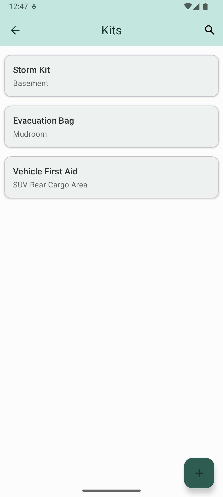

# Emergency Preparedness Manager

[](https://developer.android.com)
[](https://www.java.com)
[](https://gradle.org)
[](https://developer.android.com/training/data-storage/room)
[](https://developer.android.com/reference/android/app/AlarmManager)
[](LICENSE)
[](https://developer.android.com/about/versions/android-8.0)
[](https://developer.android.com/about/versions/15)

**Emergency Preparedness Manager** is a privacy-first, fully offline Android app that helps individuals and families organize emergency kits, track supplies, monitor expiration dates, and receive timely reminders, so you're never caught unprepared.

From hurricanes and power outages to wildfires or everyday readiness, this app puts complete control in your hands: no internet, no cloud, no tracking.

## Features

- **Multiple Kits**: Create, edit, and manage separate kits for home, car, workplace, travel, bug-out bag, or family members
- **Detailed Supply Tracking**: Add items with quantities, categories (Water, Food, Medical, Tools, etc.), brands, purchase dates, and expiration dates
- **Smart Notifications**: High-priority alerts for low stock, approaching expirations, zero-quantity items, and recurring kit checks (monthly/quarterly/yearly)
- **Material 3 UI**: Clean, modern design with light/dark/system themes and intuitive navigation
- **Fully Offline & Private**: All data stored locally using Room — no network access, no data leaves your device
- **Household Settings**: Customize household size for water/food recommendations
- **Search & Reports**: Quick search across kits/items + basic inventory report view
- **Swipe-to-Delete Protection**: Prevents deleting kits that contain items (with undo via Snackbar)

## Screenshots

WILL ADD SOON

<!-- Placeholder layout -->
<!--     -->

## Tech Stack

- **Language**: Java
- **UI**: Traditional Android Views + Material 3 components (XML layouts)
- **Architecture**: Repository pattern with callback-based async data access
- **Local Database**: Room (SQLite) for persistent kit, item, and category data
- **Background Work**: ExecutorService (fixed thread pool) + Handler for main-thread callbacks
- **Notifications**: AlarmManager + inexact repeating/setWindow alarms + BroadcastReceiver (AlertReceiver)
- **Settings**: SharedPreferences + PreferenceFragmentCompat (XML preferences)
- **Permissions**: POST_NOTIFICATIONS (Android 13+) with runtime check
- **Build Tools**: Gradle, Android Studio

## Installation

### For Users
- Currently in internal/closed testing on Google Play (opt-in link available upon request or in release notes)
- One-time $25 Google Play developer fee required for full access

### For Developers / Sideloading

1. Clone the repository:
   ```bash
   git clone https://github.com/mattworleydev/emergency-preparedness-manager-app.git