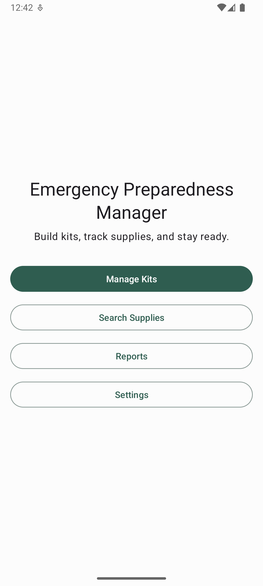
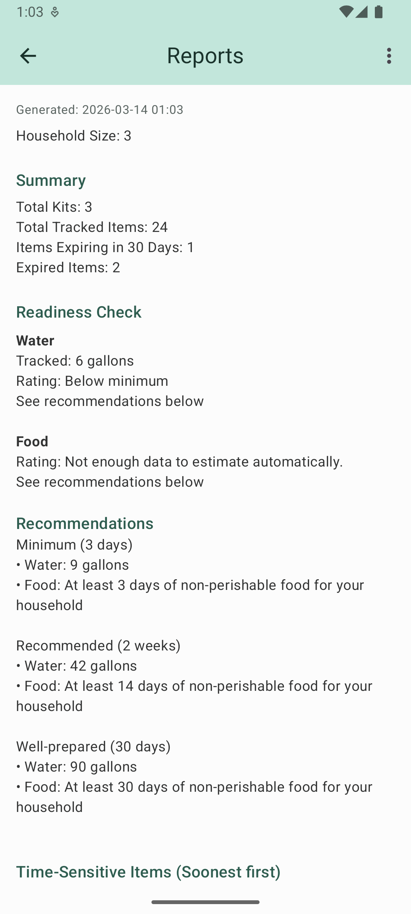
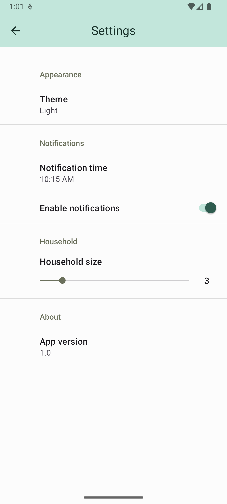

# Emergency Preparedness Manager

[](https://developer.android.com)
[](https://www.java.com)
[](https://gradle.org)
[](https://developer.android.com/training/data-storage/room)
[](https://developer.android.com/reference/android/app/AlarmManager)
[](LICENSE)
[](https://developer.android.com/about/versions/android-8.0)
[](https://developer.android.com/about/versions/15)

---

## 📱 Overview

**Emergency Preparedness Manager** is a privacy-first, fully offline Android application for managing emergency preparedness kits, tracking supplies, and monitoring expiration dates with automated reminders.

It is designed for complete local control:
- No internet required
- No cloud storage
- No tracking or analytics

The goal is simple: ensure individuals and families stay prepared for emergencies ranging from natural disasters to everyday disruptions.

---

## ✨ Features

### 📦 Inventory & Kit Management
- Create and manage multiple kits (home, car, travel, workplace, bug-out bag, etc.)
- Track items with quantity, category, brand, purchase date, and expiration date

- ### 🔔 Smart Notifications
- Low stock alerts
- Expiration warnings
- Zero-quantity alerts
- Scheduled kit check reminders (monthly, quarterly, yearly)

### 📊 Reporting & Insights
- Inventory overview report
- Quick search across all kits and items

### 🎨 User Experience
- Material 3 design system
- Light, dark, and system themes
- Swipe-to-delete protection with undo support

### 🔐 Privacy & Offline-First Design
- Fully offline operation
- Local-only storage using Room database
- No external data transmission

---

## 🧠 Architecture & Tech Stack

- **Language:** Java  
- **UI:** XML (Android Views) with Material 3 components  
- **Architecture:** Repository pattern with asynchronous callbacks  
- **Database:** Room (SQLite abstraction)  
- **Background Processing:** ExecutorService + Handler (main thread coordination)  
- **Notifications:** AlarmManager + BroadcastReceiver  
- **Settings:** SharedPreferences + PreferenceFragmentCompat  
- **Build System:** Gradle

---

## Screenshots

### Main Screen


### Kit List


### Kit Items


### Reports


### Settings


---

## 🔗 Repository

https://github.com/mattworleydev/emergency-preparedness-manager-app

---

## 🚧 Project Context

Built as a full Android capstone project demonstrating:
- Offline-first application design
- Local database architecture using Room
- Background task scheduling with Android system services
- Real-world inventory and notification logic

---

## Installation

### For Users
- Currently in internal/closed testing on Google Play
- Opt-in access available upon request

### For Developers / Sideloading

1. Clone the repository:
```bash
git clone https://github.com/mattworleydev/emergency-preparedness-manager-app.git
